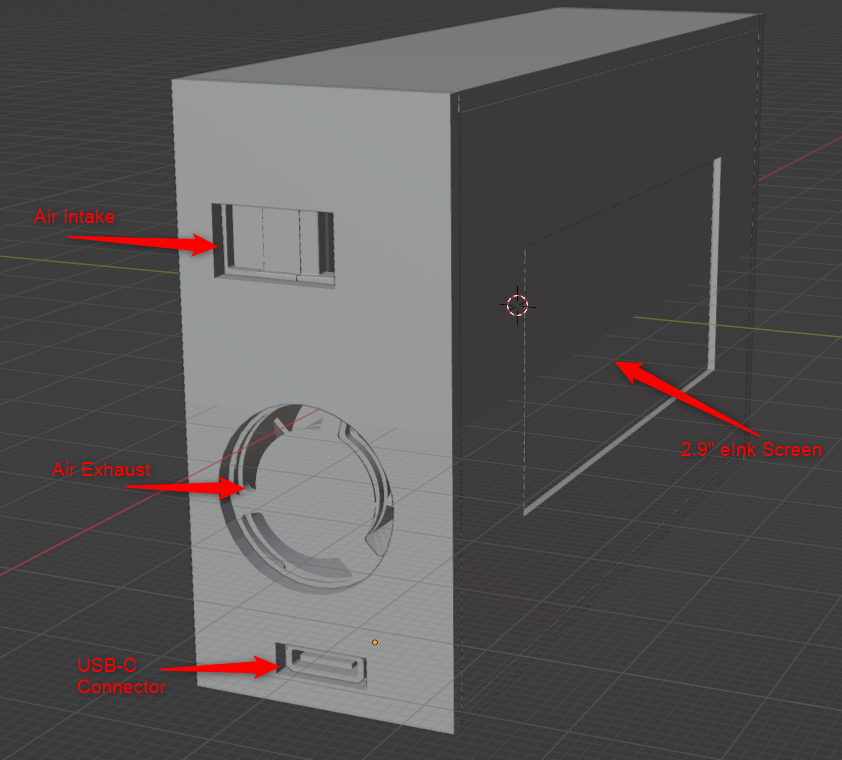

# Air Quality Sensor

The purpose of this project is to create a stand-alone sensor device for indoor capture of air quality metrics that are displayed on the eInk screen on the device as well as report measurements to Home Assistant.

# Device Details

Sensor Metrics:
- Temperature
- Humidity
- PM1, PM2.5, PM4, PM10
- VOC
- NOx

Light:
- NeoPixel led for showing alert status

# Battery Monitoring

I started out attempting to make this sensor battery powered in addition to USB powered, however I just can't get consistent results yet and so the battery monitoring component of this project has been put on hold in favor of a always plugged in design approach.

# Outside AQI Sensing

Leveraging a commercial / government sensor for outside sensing of AQI on PM2.5 is the ideal configuration.  AirNow.gov has a API which Home Assistant has a integration created to pull in the sensor data.

You must first get a API key here:
https://docs.airnowapi.org/

# Proof of Concent v5

After a number of 3D printing and fitting components this design 

# Proof of Concept v1

Original first attempt at fitting in the components and getting a feel for size and functionality.

